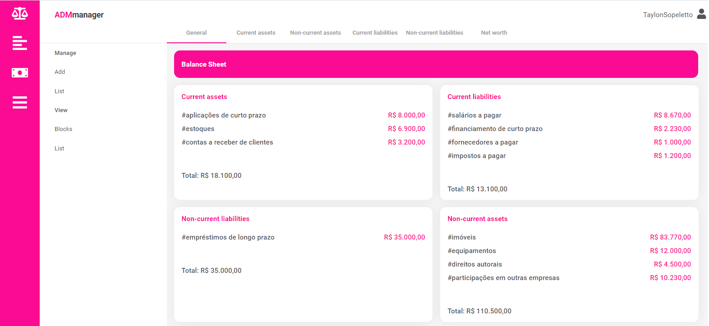

Application created to manage company finances.

## Features

### Balance Sheet

This feature give a full relatory of assets and liabilities wich are divided by current and non-current.

**current assets**: assets owned by a short period of time. Ex: stock, cash flow  
**non-current assets**: assets owned by a short period of time. Ex: stock, cash flow  
**current assets**: assets owned by a short period of time. Ex: stock, cash flow  
**non-current assets**: assets owned by a short period of time. Ex: stock, cash flow  

### Income Statement for the Year

